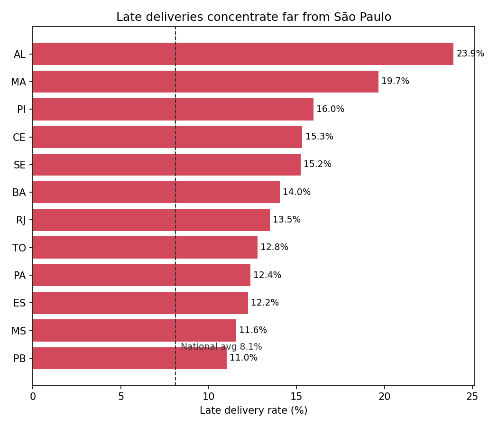

# Olist Delivery Delay Analysis

**Question:** How much do late deliveries cost in customer satisfaction — and where should Olist fix them first?

**Key finding:** 8.1% of orders arrive late — and 46% of those receive a 1-star review, vs 6.6% of on-time orders (a 7x increase).

## Where late deliveries happen
Lateness isn't about product category — rates are flat (~8–10%) across every category. It's **geographic**, concentrated on the long-haul lanes from the São Paulo hub to the Northeast and to Rio de Janeiro.

## Recommendation
Late deliveries are the single biggest driver of 1-star reviews (46% vs 6.6%), and they are geographic, not product-related — concentrated on lanes from the São Paulo hub to the Northeast (Alagoas 24%, Maranhão 20%, Ceará 15%) and to Rio de Janeiro (13.5%). Two priorities: **(1) Target Rio de Janeiro first** — the highest late rate among high-volume states (12,350 orders), so carrier/SLA fixes there recover the most reviews per dollar; **(2) Recalibrate delivery-date promises for the Northeast** — since "late" is measured against Olist's *own* estimate, more realistic dates would cut the gap that triggers 1-star reviews.

**Data:** [Brazilian E-Commerce Public Dataset by Olist](https://www.kaggle.com/datasets/olistbr/brazilian-ecommerce) (~100K orders, 2016–2018)

**Status:** In progress — exploration, category, and geography analysis complete; quantifying the RJ opportunity next.
