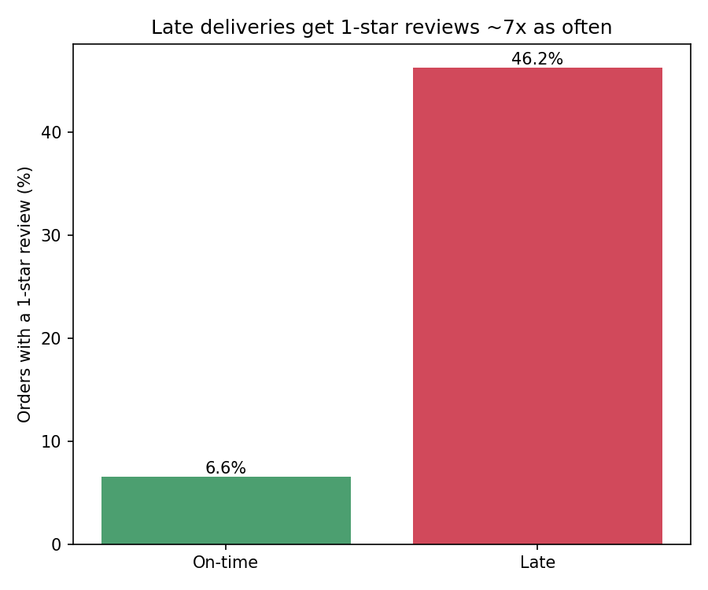

# Olist Delivery Delay Analysis

**Question:** How much do late deliveries cost in customer satisfaction?

**Key finding so far:** 8.1% of orders arrive late — and 46% of those receive
a 1-star review, vs 6.6% of on-time orders (a 7x increase).

**Data:** [Brazilian E-Commerce Public Dataset by Olist](https://www.kaggle.com/datasets/olistbr/brazilian-ecommerce) (~100K orders, 2016–2018)

**Status:** In progress — exploration complete, visualization and seller-level analysis next.
